```{r setup, include=FALSE}
options(htmltools.dir.version = FALSE)
```
```{r xaringanExtra, echo=FALSE}
xaringanExtra::use_xaringan_extra(c("tile_view", "animate_css", "tachyons"))
```


class: title-slide, center, div


.font120[Universidade Federal do Amazonas<br>
Pró-Reitoria de Pesquisa e Pós-Graduação<br>
Programa de Pós-Graduação em Física]

# <br><br>.titulo[Transporte Quântico em Redes Hexagonais]<br>

.font120[Geyson Maquiné Batalha<br>

Orientador: Dr. Mircea Daniel Galicenau<br><br>]


```{r,out.width='25%',fig.align='center',echo=FALSE}
knitr::include_graphics('cnpq_capes.svg')
```


---
# Roteiro
.animated.slideInUp[
1. Motivação

2. Teoria de Grafos e Matriz Laplaciano

3. Caminhadas Aleatórias Clássicas

4. Caminhadas Aleatórias Csssslássicas de Tempo Discreto em Grafos

5. Caminhadas Aleatórias Clássicas de Tempo Contínuo em Grafos

6. Caminhadas Qurerereânticas de Tempo Contínuo

7. Procedimentos

8. Resultados

9. Conclusões
]


---
# Motivação
## Caminhadas Clássicas

- Robert Brown (1828)

.pull-left[
.center[
.font80[
.caption[Figura 1: Robert Brown (1773-1858).]

```{r, out.width='50%', fig.align='center' ,echo=FALSE}
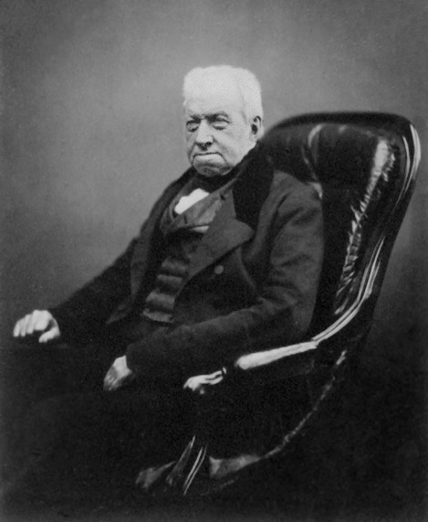
```

.caption[Fonte: <https://en.wikipedia.org/wiki/Robert_Brown_
(botanist,_born_1773)>.]
]
]
]
--
.pull-right[
.center[
.font80[
.caption[Figura 2: Movimento Browniano.]

```{r, out.width='60%', fig.align='center',echo=FALSE}
knitr::include_graphics('02.gif')
```

.caption[Fonte: https://en.wikipedia.org/wiki/Brownian_motion.]
]
]
]

---
# Motivação
## Caminhadas Clássicas


- Karl Pearson (1905)

.pull-left[
.center[
.font80[
.caption[Figura 3: Karl Pearson (1857-1936).]

```{r, out.width='70%', fig.align='center' ,echo=FALSE}
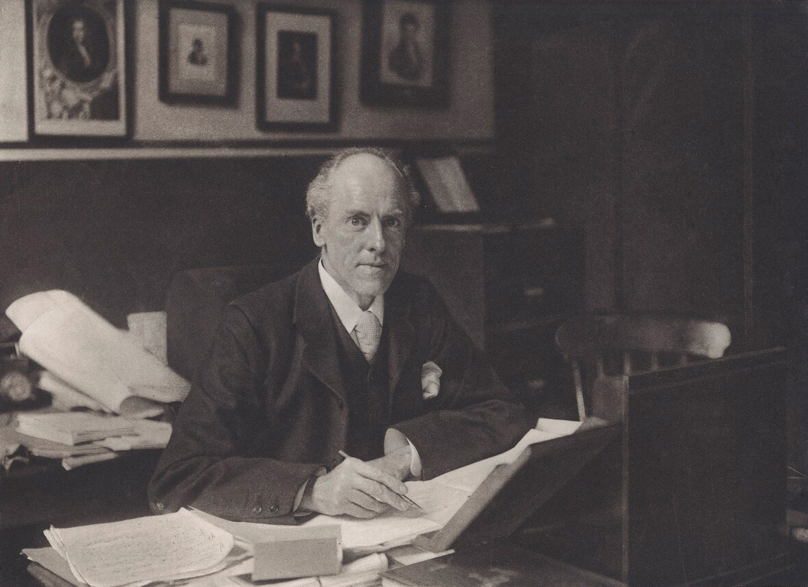
```

.caption[Fonte: <https://en.wikipedia.org/wiki/Karl_Pearson>.]
]
]
]

.pull-right[
.center[
.font80[


```{r, out.width='90%', fig.align='center',echo=FALSE}
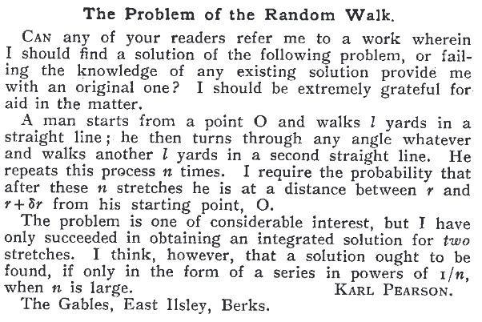
```

.caption[Fonte: Pearson (1905).]
]
]
]


---
# Motivação
## Caminhadas Quânticas

.pull-left[
.center[
.font80[
.caption[Figura 4: Richard Phillips Feynman (1918-1988).]

```{r, out.width='50%', fig.align='center' ,echo=FALSE}
knitr::include_graphics('23.jpg')
```

.caption[Fonte: <https://en.wikipedia.org/wiki/Richard_Feynman>.]
]
]
]

.pull-right[
.center[
.font80[


```{r, out.width='80%', fig.align='center',echo=FALSE}
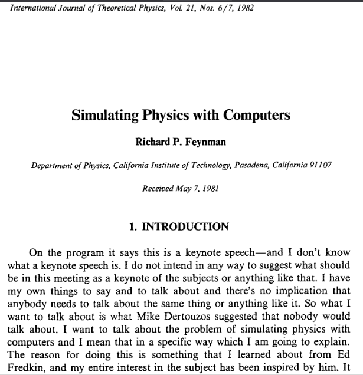
```

.caption[Fonte: Feynman (1982).]
]
]
]

---
# Motivação
## Caminhadas Quânticas
.pull-left[
- Tempo discreto
  + Yakir Aharonov et al. (1993)
  + Espaço moeda e Espaço posição
  
  


]
.pull-right[
- Tempo Contínuo
  + Farhi e Gutmann (1998)
  + $U(t)=e^{-i\mathbf{H}t}$

]


.font80[
.center[
.caption[Figura 5: Ilustração da caminhada clássica e quântica.]

```{r, out.width='35%',fig.show='hold' ,echo=FALSE}
knitr::include_graphics(c('caminhada_classica.gif','caminhada_quantica.gif'))
```

Fonte: https://physik.uni-paderborn.de/en/silberhorn/forschung/quantum-networking/quantum-walks.
]

]

---
class: justificado
# Motivação
## Caminhadas Quânticas  

```{r, out.width='60%',fig.align='center' ,echo=FALSE}

```

---
# Motivação

.pull-left[
.center[
.font80[


```{r, out.width='95%', fig.align='center' ,echo=FALSE}
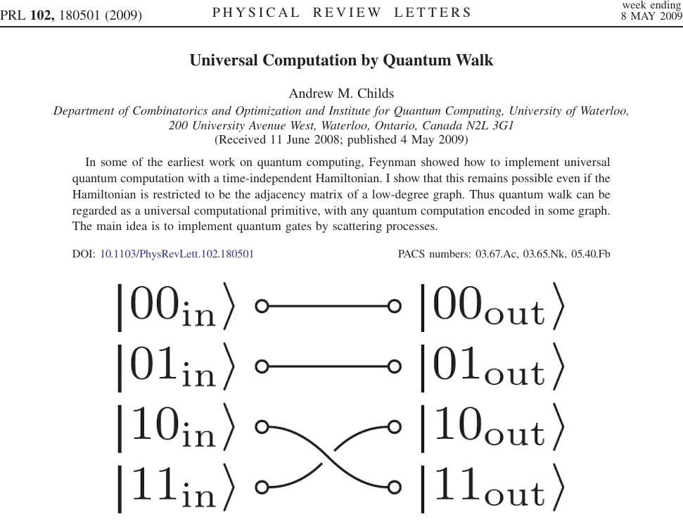
```

.caption[Fonte: Childs (2009).]
]
]
]

.pull-right[
.center[
.font80[


```{r, out.width='80%', fig.align='center',echo=FALSE}
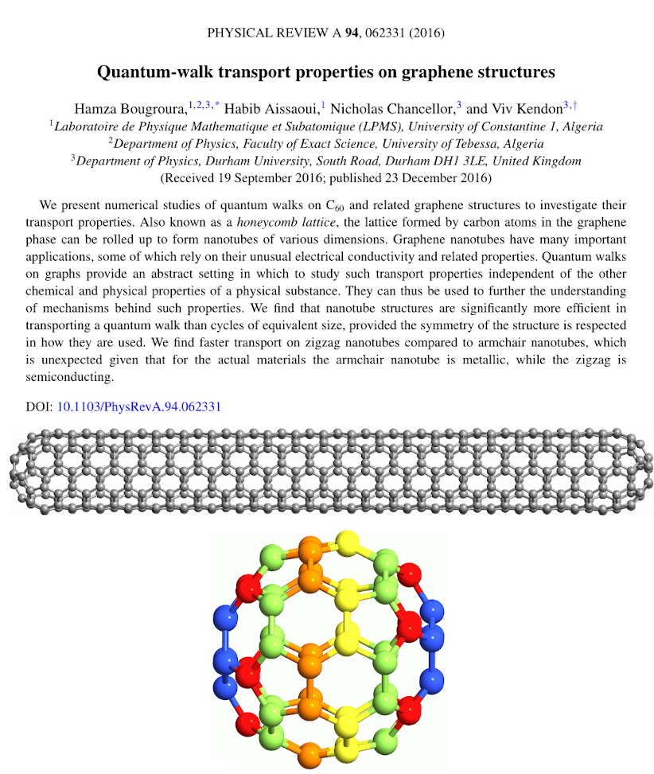
```

.caption[Fonte: Bougroura et al. (2016).]
]
]
]


---
class: justificado
# Motivação

## Carbono

.pull-left[
```{r, out.width='90%', fig.align='center' ,echo=FALSE}
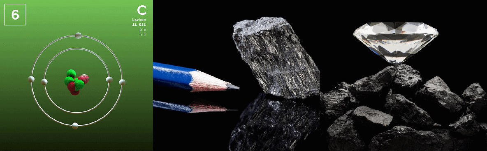
```

.font80[
Figura 6: Distribuição eletrônica em orbitais para as hibridizações do carbono, que da esquerda para direita temos os tipos $sp$, $sp^2$ e $sp^3$. Os orbitais hibridizados são originados a partir da superposição dos orbitais $2s$ e $2p$.
.center[

```{r, out.width='90%', fig.align='center' ,echo=FALSE}
knitr::include_graphics('hibri.svg')
```

]
]
]

.pull-right[

.font80[
Figura 7: Estrutura favo de mel composta por sub-redes $A$ e $B$, representadas por círculos branco e preto, respectivamente. Os vetores $\vec{a}_1$ e $\vec{a}_2$ indicam os vetores primitivos da sub-rede $A$ de tamanho $a$.
.center[

```{r, out.width='70%', fig.align='center',echo=FALSE}
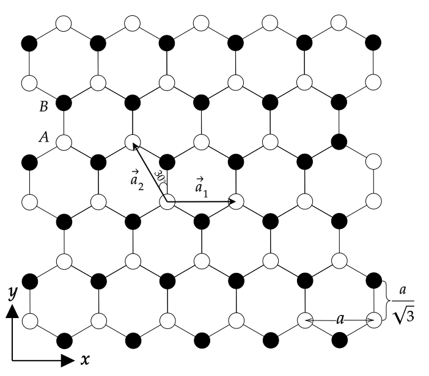
```

$$ \vec{a}_1=a\hat{\imath}\quad \text{ e } \quad\vec{a}_2= -\dfrac{a}{2}\hat{\imath}+\dfrac{a\sqrt{3}}{2}\hat{\jmath}$$
]
]
]

---
class: justificado
# Motivação

## Fulereno

.pull-left[

.font80[
Figura 8:  Da direita para esquerda temos: Sean O’Brien,
Richard Smalley, Robert Curl, Harry Kroto, and James Heath.
.center[

```{r, out.width='70%', fig.align='center' ,echo=FALSE}
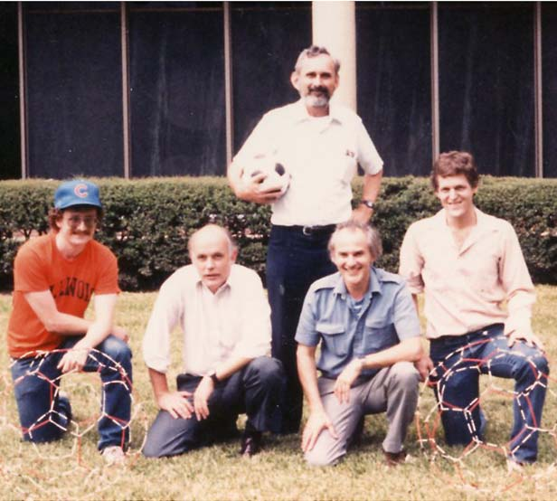
```

Fonte: Landmarks (2010).
]
]
]

.pull-right[

.font80[
Figura 9: Na parte superior mostra a semelhança entre $C_{60}$ e uma bola de futebol, abaixo mostra a paridade entre $C_{70}$ e a bola de rúgbi.
.center[

```{r, out.width='80%', fig.align='center',echo=FALSE}
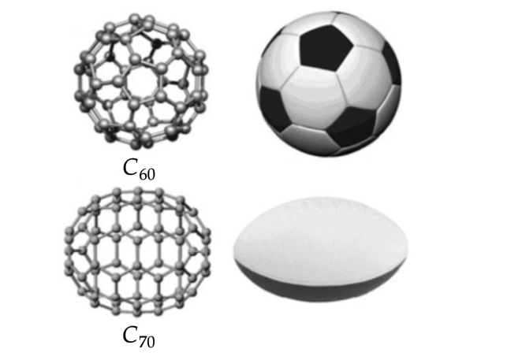
```

Fonte: Dinadayalane e Leszczynski (2010).
]
]
]

---
class: justificado
# Motivação

## Grafeno

.pull-left[

.font80[
.center[
Figura 10: Andre Geim e Konstantin Novoselov.

```{r, out.width='90%', fig.align='center' ,echo=FALSE}

```

Fonte: Amos (2010).
]
]
]

.pull-right[

.font80[

Figura 11: O grafeno é considerado a "Mãe" de todas as formas grafíticas, em que sua construção 2D pode gerar materiais de outras dimensionalidades. O material pode ser embrulhado para formar fulerenos (0D), enrolado forma nanotubos (1D) ou empilhado forma o grafite (3D). 

.center[
```{r, out.width='70%', fig.align='center',echo=FALSE}
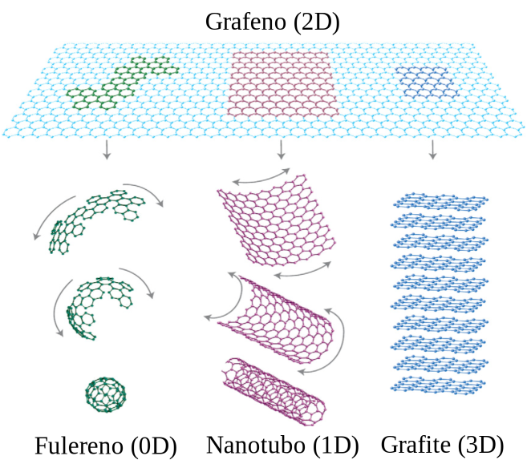
```

Fonte: Adaptado de Geim e Novoselov (2007).
]
]
]

---
class: justificado
# Motivação

## Propriedades e Potenciais Aplicações

```{r, out.width='85%', fig.align='center',echo=FALSE}
knitr::include_graphics('apli.svg')
```


---
class: justificado
# Objetivo

.meio[


- Determinar qual tipo de nanoestrutura apresenta o transporte mais eficiente e o mais ineficiente
  + Três estruturas de grafeno com diferentes dimensionalidades
  + Fulerenos $C_{60}$ e $C_{70}$. ]


---
class: justificado
# Teoria de Grafos e Matriz Laplaciano

**Definição:**	*Um grafo $G=(V,E)$ é formado por um  conjunto finito não-vazio V e um conjunto E de pares não-ordenados de elementos distintos de $V$. O conjunto  $V$ possui $N$ elementos denominados de vértices, enquanto $E$  terá M pares de elementos denominados arestas. Desta forma, temos que  $V = (v_1,v_2,v_3,\ldots,v_N)$ e $E=(e_1,e_2,e_3,\ldots,e_M)$, onde $e_k = (v_i,v_j)$ e corresponde as arestas adjacentes do grafo.*


.center[
.font80[
Figura 12: Exemplo de grafo com  número de vértices $V= 4$ e arestas $E=4$.

```{r, out.width='25%', fig.align='center' ,echo=FALSE}
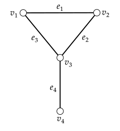
```
]
]

$$G=\{\{v_1,v_2,v_3,v_4\},\{e_1=(v_1,v_2),e_2=(v_2,v_3), e_3=(v_1,v_3),e_4=(v_3,v_4)\}\}$$


---
class: justificado
# Teoria de Grafos e Matriz Laplaciano

## Grafos Planares


.font80[
Figura 13: Representações do grafo $G_1$, em que a primeira estrutura apresenta arestas que se cruzam, resultando em um grafo planar. Enquanto as três últimas estruturas, possuem arestas independentes, consequentemente serão grafos planares.
.center[

```{r, out.width='90%', fig.align='center' ,echo=FALSE}
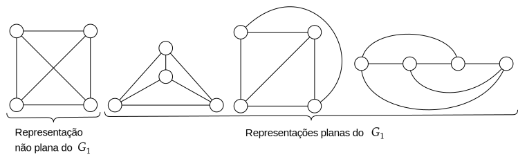
```
]
]


---
class: justificado
# Teoria de Grafos e Matriz Laplaciano

## Diagramas de Schlegel

.center[
.font80[

Figura 14: Representação dos  sólidos Platônicos (parte superior) e seus respectivos diagramas de Schlegel (parte inferior). 


```{r, out.width='35%', fig.align='center' ,echo=FALSE}
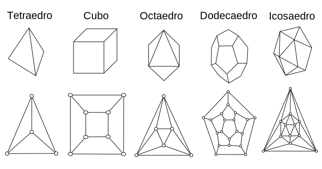
```

]

]

- Fórmula de Euler para poliedros 
.center[$$V-E+F=2$$]
- Fulereno $C_n$
.cemter[$$P=12, \quad H=\dfrac{n}{2}-10$$]
  + $C_{60}$:  12 pentágonos e 20 hexágonos; $C_{70}$: 12 pentágonos e 25 hexágonos.
  
---
class: justificado
# Teoria de Grafos e Matriz Laplaciano

## Matriz Adjacência


$$\large A_{ij} = \begin{cases} 1, & \text{se ocorrer ligação entre os vértices } i  \text{ e }j, \\ 0, & \text{caso contrário}. \end{cases}$$


.pull-left[

```{r, out.width='70%', fig.align='center' ,echo=FALSE}

```


]

.pull-right[
<br><br><br>


$$\large\mathbf{A} =
	\begin{pmatrix}
		0&1&1&0 \\
		1&0&1&0 \\
		1&1&0&1 \\
		0&0&1&0 
		\end{pmatrix}$$


]

---
class: justificado
# Teoria de Grafos e Matriz Laplaciano

## Matriz Laplaciano


$$L_{ij} =\begin{cases}\;\;k_i, & i=j, \\-1,&\text{se } i \neq j \text{ e ocorrer ligação entre os vértices } i \text{ e } j ,\\\;\;\;0,& \text{caso contrário}.\end{cases}$$


.pull-left[

```{r, out.width='70%', fig.align='center' ,echo=FALSE}

```


]

.pull-right[


$$\mathbf{L}=\begin{pmatrix}
	\;\;2 & -1 &-1& \;\;0\\
	-1& \;\;2 & -1 &\;\;0\\
	-1&-1&\;\;3&-1\\
	\;\;0&\;\;0& -1&\;\;1
\end{pmatrix}$$


- Autovalores e autovetores


$$\mathbf{LW=\Lambda W}$$
para $\mathbf{W}^T=\mathbf{W}^{-1}$.


$$L_{ij}\mathbf{w}_i=\lambda_i\mathbf{w}_i$$
$$0=\lambda_1\leq\lambda_2\leq \dots\leq \lambda_{N}$$

]

---
class: justificado

# Caminhadas Aleatórias Clássicas


.pull-left[
.font80[

Figura 15: Ilustração de uma rede unidimensional, em que o caminhante executa passos discretos de tamanho $\ell$.

.center[

```{r, out.width='100%', fig.align='center' ,echo=FALSE}

```

]
]

$$\wp_T=p+q=1$$

-   p: probabilidade de ir para direita;
-   q: probabilidade de ir para esquerda;

$$\small \wp_N(n)=\dfrac{N!}{\left[\frac{1}{2}  (N+n)\right]!\times \left[\frac{1}{2} ( N-n)\right]!}\times p^{\frac{1}{2}[ N+n]}\times(1-p)^{\frac{1}{2} [N-n]}$$
]

.pull-right[

.font80[

Figura 16: Gráfico da distribuição de probabilidade $\wp_N(n)$, para uma caminhada aleatória de 50 passos. Tal distribuição, nos traz a probabilidade do caminhante ir para esquerda ou direita, com isso obtemos uma gaussiana centrada no seu ponto de partida (ou seja $x=0$).

.center[
```{r, out.width='100%', fig.align='center',echo=FALSE}
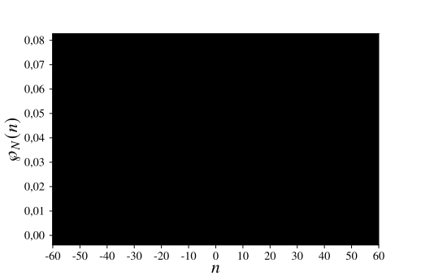
```


]
]
]


---
class: justificado

# Caminhadas Aleatórias Clássicas de Tempo Discreto em Grafos

## Cadeias de Markov


```{r, out.width='70%', fig.align='center',echo=FALSE}

```


---
class: justificado

# Caminhadas Aleatórias Clássicas de Tempo Discreto em Grafos

## Cadeias de Markov Discreta
.font80[
.center[
Figura 17: Representação de uma cadeia de Markov, em que cada  estado é fixo durante um período  de tempo $n$.

```{r, out.width='50%', fig.align='center',echo=FALSE}

```
]]

- Probabilidades de Transição
$$P(X_{n+1}=j|X_n=i,\;X_{n-1}=i_{n-1},\ldots,X_0=i_0)=P(X_{n+1}=j|X_n=i)$$
$$p_{i,j}=P(X_{n+1}=j|X_n=i)=P(X_1=j|X_0=i)\text{ (período de tempo homogêneneo)}$$
.pull-left[
$$\mathbf{P}=\begin{pmatrix}
		p_{0,0} & p_{0,1} & \cdots & p_{0,N}\\
		p_{1,0} & p_{1,1} & \cdots & p_{1,N}\\
		\vdots & \vdots & \ddots & \vdots\\
		p_{N,0} & p_{N,1} & \cdots & p_{N,N}
	\end{pmatrix}$$

]

.entre[
<br>
$$\huge\Longrightarrow$$
]


.pull-right[

$$p_{i,j}\geq 0 \text{ para todo } i \text{ e } j$$
$$\sum_{j=0}^{N} p_{i,j} =1 \text{ para todo } i$$
]


---
class: justificado

# Caminhadas Aleatórias Clássicas de Tempo Discreto em Grafos

## Caminhadas Aleatórias
.font80[

Figura 18: Diagrama de transição de estados para uma caminhada aleatória unidimensional com estados inteiros. O processo tem início a partir do estado 0, cada passo executado para direita ou esquerda, gera uma probabilidade de transição $p$ e $1-p$ respectivamente.

```{r, out.width='70%', fig.align='center',echo=FALSE}

```


Figura 19: Grafo de transição correspondente a caminhada aleatória unidimensional, no qual as arestas unidirecionais determinam tanto a probabilidade do caminhante ir para direita quanto  a esquerda.

```{r, out.width='70%', fig.align='center',echo=FALSE}

```
]

---
class: justificado
# Caminhadas Aleatórias Clássicas de Tempo Discreto em Grafos

## Caminhadas Aleatórias

**Definição:** *Dado $G=(V,E)$ um grafo conectado unidirecionalmente contendo $N$ vértices e $M$ arestas. A partícula se move sobre os vértices de $G$, com passos ao longo das arestas. Para a posição da partícula $X_n$ no tempo $n$, em $n+1$ ela irá se mover para seu vizinho mais próximo. Assim, a caminhada aleatória é uma cadeia de Markov $\mathbf{X}=\{X_n: n\geq 0\}$ com espaço de estado $V$ e probabilidades de transição $p_{i,j}$ dadas por*

$$p_{i,j}=\begin{cases}\dfrac{1}{k_i},\text{ se } i \text{ e } j \text{ são vizinhos},\\0,\text{ caso contrário}.\end{cases}$$

.pull-left[

```{r, out.width='43%', fig.align='center' ,echo=FALSE}

```


]

.pull-right[
<br>


$$\mathbf{P}=\begin{pmatrix}
			0 & 1/2 & 1/2 & 0\\
			1/2 & 0 & 1/2 &0\\
			1/3&1/3&0& 1/3\\
			0& 0 &1&0
		\end{pmatrix}$$


]

---
class: justificado
# Caminhadas Aleatórias Clássicas de Tempo Contínuo em Grafos

## Cadeias de Markov de Tempo Contínuo

- Probabilidades de Transição

$$p_{i,j}(t)=P[X(t+s)=j|X(s)=i]=P[X(t)=j|X(0)=i]$$
- Estado futuro

$$p_{i,j}(t+s)=P[X(t+s)=j|X(0)=i]$$
- Chapman-Kolmogorov

$$p_{i,j}(t+s)=\sum_{k=0}^N p_{i,k}(t)p_{k,j}(s)$$

- Equação de Kolmogorov (Para $\Delta t\rightarrow 0$)

$$\dfrac{d\mathbf{P}(t)}{dt}=\mathbf{Q}\mathbf{P}(t) \rightarrow 	\mathbf{P}(t)=e^{\mathbf{Q} t}$$


---
class: justificado
# Caminhadas Aleatórias Clássicas de Tempo Contínuo em Grafos

## Caminhadas aleatórias de Tempo Contínuo

$$q_{a,b}=\begin{cases}\;\;\;\; \;\;\gamma, \text{ se } a\neq b\text{  e ocorrer ligação entre os vértices } a \text{ e } b,  \\ \;\;\;\; \;\;0,\text{ se } a\neq b \text{ e não ocorrer ligação entre os vértices  } a \text{ e } b,\\ -k_a\gamma, \text{ se } a=b.\end{cases}$$
para  $\mathbf{Q}=-\gamma\mathbf{L}$.

$$\mathbf{P}(t)=e^{-\gamma\mathbf{L}t}\rightarrow p_{a,b}(t)=\langle b|e^{-\gamma \mathbf{L} t}|a\rangle$$

- Vetores base para caminhada clássica e quântica:

$$	|1\rangle =\begin{pmatrix}
	1\\
	0\\
	\vdots\\
	0
\end{pmatrix},\;|2\rangle=\begin{pmatrix}
	0\\
	1\\
	\vdots\\
	0
\end{pmatrix},\ldots,\;|N\rangle=\begin{pmatrix}
	0\\
	0\\
	\vdots\\
	1
\end{pmatrix}$$


---
class: justificado
# Caminhadas Aleatórias Clássicas de Tempo Contínuo em Grafos

## Caminhadas aleatórias de Tempo Contínuo

.pull-left[
Para $\gamma\equiv 1$:

- Probabilidade de Transição Clássica

$$p_{a,b}(t)=\sum_{n=1}^Ne^{- \lambda_n t}\langle b|w_n\rangle\langle w_n|a\rangle$$

]
.pull-right[

- Probabilidade Média de Retorno Clássico

$$\bar{p}(t)=\dfrac{1}{N}\sum_{a=1}^Np_{a,a}(t)$$
$$\bar{p}(t)= \dfrac{1}{N}\sum_{n=1}^Ne^{- \lambda_n t}$$

]

- No limite ao longo do tempo

$$\lim_{t\rightarrow \infty}\bar{p}=\dfrac{1}{N}$$


---
class: justificado
# Caminhadas Quânticas de Tempo Contínuo

.pull-left[
- Equação de Schrödinger

	Para $m\equiv 1$ e $\hslash\equiv 1$ :
	
	$$i\dfrac{d|a\rangle}{dt}=\mathbf{H}|a\rangle\rightarrow |a;t\rangle=e^{-i\mathbf{H}t}|a\rangle$$

]

.pull-right[

- Amplitude de Transição

$$\alpha_{a,b}=\langle b|a;t\rangle$$
$$\dfrac{d\alpha_{a,b}(t)}{dt}=-i\sum_l H_{b,l}\alpha_{l,a}(t)\rightarrow \alpha_{a,b}=\langle b|e^{-i\mathbf{H} t}|a\rangle$$


]

$$\alpha_{a,b}(t)=\langle b|e^{-i\mathbf{H} t}|a\rangle=\langle b |e^{-i\gamma\mathbf{L}t}|a\rangle,$$
então $\mathbf{H}=\gamma \mathbf{L}$ e para $\gamma\equiv 1$:
$$\mathbf{H}=-\mathbf{Q}=\mathbf{L}$$

.pull-left[

- Probabilidade de Transição Quântica

$$\pi_{a,b}(t)=\left|\alpha_{a,b}(t)\right|^2=\left|\sum_{n=1}^Ne^{-i\lambda_n t}\langle b|w_n\rangle\langle w_n|a\rangle\right|^2$$
]
.pull-right[

- Valor Médio

$$\chi_{a,b}=\sum_{n=1}^N\sum_{m=1}^N\delta_{\lambda_n\lambda_m}\langle b|w_n\rangle\langle w_n|a\rangle\langle a |w_m\rangle \langle w_n|b\rangle$$

]

---
class: justificado
# Caminhadas Quânticas de Tempo Contínuo
.pull-left[

- Probabilidade Média de Retorno Quântico
$$\bar{\pi}(t)=\dfrac{1}{N}\sum_{a=1}^N\pi_{a,a}(t)$$
$$\bar{\pi}(t)=\dfrac{1}{N}\sum_{a=1}^N\left|\sum_{n=1}^Ne^{-i\lambda_n t}\langle a|w_n\rangle\langle w_n|a\rangle\right|^2$$

]
.pull-right[

- Valor Médio

$$\bar{\chi}=\dfrac{1}{N}\sum_{a=1}^N\left[\sum_{n=1}^N\sum_{m=1}^N\delta_{\lambda_n\lambda_m}|\langle w_n|a\rangle|^2|\langle w_m|a\rangle|^2\right]$$

]

- Limite Inferior

$$\bar{\pi}(t)\geq \left|\dfrac{1}{N}\sum_{a=1}^Ne^{-i\lambda_n t}\right|^2=|\bar{\alpha}(t)|^2,\qquad 	\chi_{a,b}\geq \dfrac{1}{N^2}\equiv \chi_{a,b}^*,\qquad	\bar{\chi}\geq \dfrac{1}{N^2}\sum_{n=1}^N\sum_{m=1}^N\delta_{\lambda_n\lambda_m}\equiv \bar{\chi }^*$$
$$\begin{aligned}\blacktriangleright\;\bar{\chi }=0\text{, O tranporte é mais eficiente} \;\;\\ \blacktriangleright\;\bar{\chi }=1\text{, O tranporte é mais ineficiente}\end{aligned}$$
---
class: justificado
# Procedimentos

## Folhas de Grafeno
.pull-left[
.font80[

Figura 20: Representação das folhas de grafeno enumeradas, no qual à esquerda tem-se uma rede com dimensão $(H_x, H_y)=(17,1)$ na parte superior e na região inferior a estrutura com  $(H_x,H_y)=(8,3)$. Ao lado direito, é apresentado a folha de grafeno de tamanho $(H_x,H_y)=(5,5)$.

```{r, out.width='100%', fig.align='center',echo=FALSE}
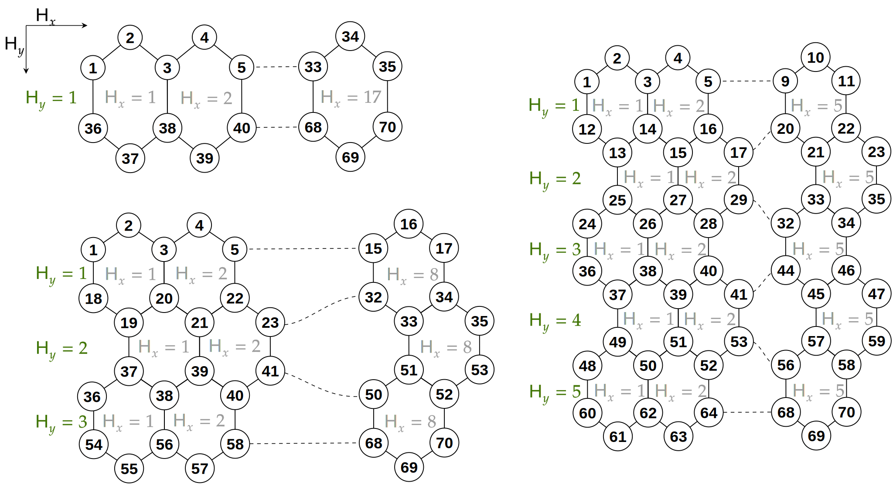
```
]]

.pull-right[

-  Primeira e última linha

$$2H_x+1$$
-  Linhas interiores $(H_y>1)$

$$2H_x+2$$
- Total de vértices e arestas

$$V_G=2(H_x+H_y+H_xH_y)$$
$$E_G=V_G+H_xH_y-1$$
]

---
class: justificado
# Procedimentos

## Fulerenos 

.pull-left[

.font80[

Figura 21: Diagrama de Schlegel do Fulereno $C_{60}$, mostrando a localização dos carbonos e as ligações entre eles.

```{r, out.width='90%', fig.align='center',echo=FALSE}
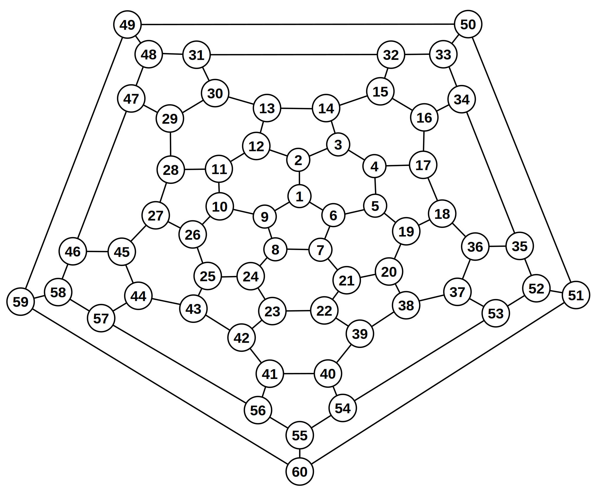
```

.center[Fonte: Adaptado de Silant’ev (2017b).]
]

]

.pull-right[
.font80[

Figura 22: Diagrama de Schlegel do Fulereno $C_{70}$, mostrando a localização dos carbonos e as ligações entre eles.

```{r, out.width='85%', fig.align='center',echo=FALSE}
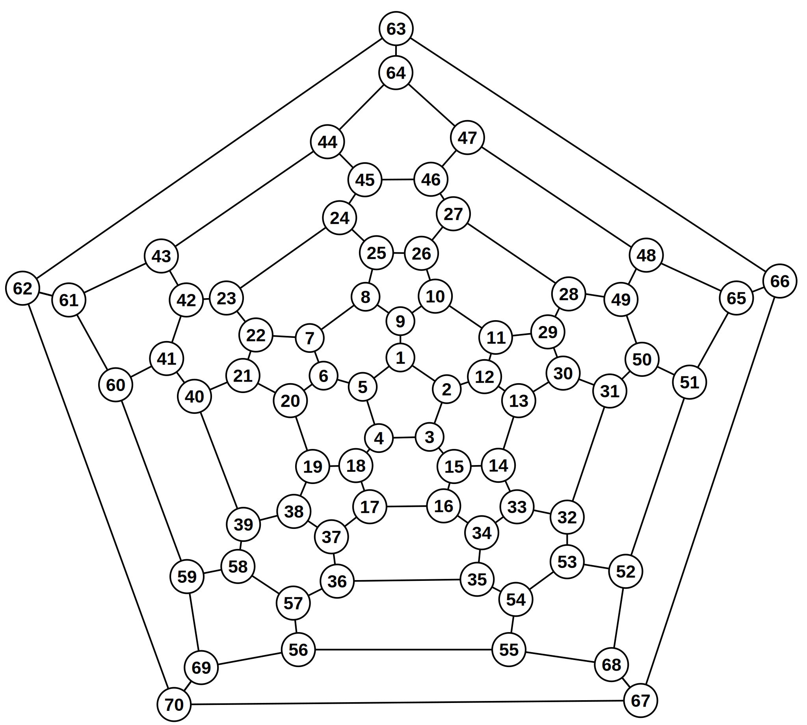
```

.center[Fonte: Adaptado de Silant’ev (2017a).]
]

]

---
class: justificado
# Procedimentos

## Passos da Implementação

.pull-left[
<br><br><br>

```{r, out.width='98%', fig.align='center',echo=FALSE}

```

]

.pull-right[

```{r, out.width='80%', fig.align='center',echo=FALSE}

```

]


---
class: justificado
# Resultados

## Probabilidade Média de Retorno Clássico

.font80[
Figura 23: Gráfico da probabilidade média de retorno $\bar{p}(t)$ para uma caminhada aleatória clássica. Observa-se que no limite ao longo do tempo, a probabilidade decai a um valor de $1/N$, em que $N=70$ para as folhas de grafeno com dimensões (17,1), (8,3), (5,5) e o fulereno $C_{70}$, e $N=60$ para o fulereno $C_{60}$.

```{r, out.width='70%', fig.align='center',echo=FALSE}
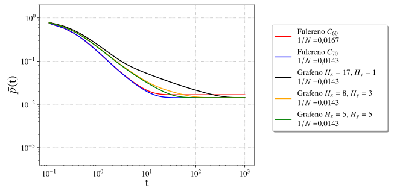
```


]

---
class: justificado
# Resultados

## Probabilidade Média de Retorno Quântico

.font80[
Figura 24: Gráfico da probabilidade média de retorno quântico $\bar{\pi}(t)$ das redes de grafeno e fulereno. Constata-se que nas curvas dos fulerenos as oscilações reduzem quando maior é o número de vértices na rede, enquanto no grafeno o aumento de  $H_y$  resulta na redução de desempenho no transporte.

```{r, out.width='70%', fig.align='center',echo=FALSE}
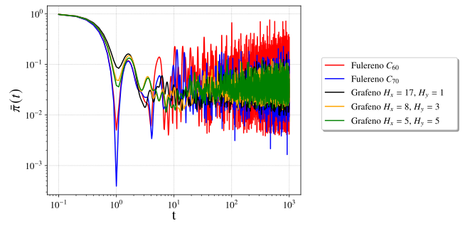
```


]

---
class: justificado
# Resultados 


.font80[
.center[
Figura 25: Gráficos de contorno da probabilidade de transição $\pi_{a,b}(10)$.] 
.taba[(a) Fulereno $C_{60}$] 
.tabb[ (b) Fulereno $C_{70}$ ] 
.tabc[(c) Grafeno (17,1) ] 
.tabd[(d) Grafeno (8,3)]
.center[
```{r, out.width='25%', fig.show='hold',echo=FALSE}
knitr::include_graphics(c('prob_transicao_Fulereno_C60.svg','prob_transicao_Fulereno_C70.svg','prob_transicao_Grafeno_17_1.svg','prob_transicao_Grafeno_8_3.svg'))
```
]]
.font80[.center[
(e) Grafeno (5,5)]
```{r, out.width='25%', fig.align='center',echo=FALSE}
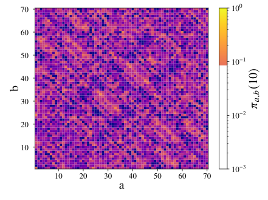
```


]


---
class: justificado
# Resultados

## Eficiência de $\bar{\chi}$


.font80[
.center[
Figura 26: Representação gráfica do valor médio  $\bar{\chi}$  e seu  limite inferior $\bar{\chi }^*$ obtidos  para as folhas de grafeno e fulerenos.

```{r, out.width='50%', fig.align='center',echo=FALSE}
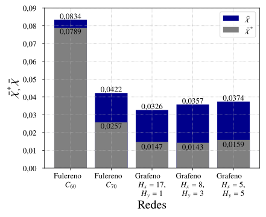
```


]]


---
class: justificado
# Resultados

## Espectro de Autovalores


.font80[
Figura 27: Espectro de autovalores para as folhas de grafeno e os  fulerenos. As curvas mais contínuas representam estruturas com menor ocorrência de autovalores degenerados e as regiões em que $\lambda$ é constante são as degenerescências.

```{r, out.width='70%', fig.align='center',echo=FALSE}
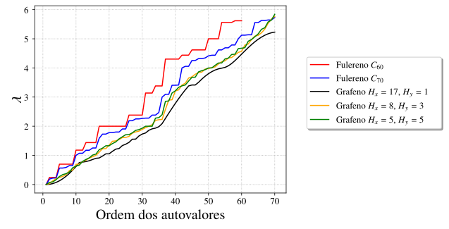
```


]

---
class: justificado
# Conclusões

- Probabilidade Média de Retorno Clássico
  + Melhor Transporte: Fulereno $C_{70}$
  + Pior Transporte: Grafeno (17,1)
- Probabilidade Média de Retorno Quântico
  + Melhor Transporte: Grafeno (17,1)
  + Pior Transporte: Fulereno $C_{60}$
- Probabilidade de Transição Quântica
  + As estruturas $C_{60}$, $C_{70}$ e o grafeno (8,3)  apresentaram efeitos de localização   na região antidiagonal
  + $C_{70}$ teve 5 zonas de com baixas probabilidades na região antidiagonal
  + O grafeno (17,1) apresentou regiões de localização em um bloco $2\times 2$
  + O grafeno (5,5) teve uma mistura de ondas de interferência
- Eficiência do Transporte
  + Eficiente: Grafeno (17,1)
  + Ineficiente: Fulereno $C_{60}$

---
class: justificado
# Cronograma

.font90[

Abaixo, estão algumas atividades desenvolvidas até o momento, antes do exame de qualificação, e na sequência as atividades a serem desenvolvidas até o final deste curso de Mestrado.

**Março de 2020 a Setembro de 2020**

 - Levantamento bibliográfico e implementação dos códigos preliminares. Disciplina cursada: Mecânica Quântica A.
 
**Outubro de 2020 a Janeiro de 2021** 

- Escrita do pré-projeto para o  Exame de Qualificação. Obtenção do certificado de Proficiência. Disciplinas cursadas: Seminários  I e Física do Estado Sólido.

**Março de 2021 a Julho de 2021**

- Disciplinas cursadas: Estágio em Docência I  e Caracterização de   Materiais. Exame de qualificação.

**Agosto de 2021 a Dezembro de 2021**

- Escrita do texto final da Dissertação de Mestrado. Revisão dos resultados obtidos.

**Janeiro de 2022**

- Defesa da Dissertação de Mestrado
]

---
class: justificado
# Referências

AHARONOV, Y. et al. Quantum random walks. Physical Review A, American Physical Society, College Park,
v. 48, n. 2, p. 1687–1690, Agosto 1993.

AMOS, H. Nobel Winners Tell Why Russia Lacks Allure. 2010. Disponível em: <https://www.themoscowtimes.
com/2010/10/20/nobel-winners-tell-why-russia-lacks-allure-a2360>. Acesso em: 30 maio 2021.

BOUGROURA, H. et al. Quantum-walk transport properties on graphene structures. Physical
Review A, American Physical Society (APS), College Park, v. 94, n. 6, dec 2016. Disponível em: <https:
//doi.org/10.1103%2Fphysreva.94.062331>. Acesso em: 15 out. 2021.

BROWN, R. Xxvii. a brief account of microscopical observations made in the months of june, july and august 1827, on the particles contained in the pollen of plants; and on the general existence of active molecules in  organic and inorganic bodies. The Philosophical Magazine, Taylor & Francis, v. 4, n. 21, p. 161–173, 1828.

BROWNIAN motion. Wikipedia. 2020. Disponível em: <https://en.wikipedia.org/w/index.php?title=
Brownian_motion&oldid=936051137>. Acesso em: 30 de maio de 2020.

CHABAN, V. V. et al. Buckybomb: Reactive molecular dynamics simulation. The Journal of Physical
Chemistry Letters, American Chemical Society (ACS), v. 6, n. 5, p. 913–917, feb 2015. Disponível em:
<https://doi.org/10.1021%2Facs.jpclett.5b00120>. Acesso em: 30 de out. de 2021.


---
class: justificado

# Referências

CHILDS, A. M. Universal computation by quantum walk. Physical Review Letters, American Physical Society (APS), College Park, v. 102, n. 18, Maio 2009.


DINADAYALANE, T. C.; LESZCZYNSKI, J. Remarkable diversity of carbon-carbon bonds: structures and
properties of fullerenes, carbon nanotubes, and graphene. Structural Chemistry, Springer Science and
Business Media LLC, New York, v. 21, n. 6, p. 1155–1169, nov 2010. Disponível em: <https://doi.org/10.1007%
2Fs11224-010-9670-2>. Acesso em: 15 ago. 2021.

FARHI, E.; GUTMANN, S. Quantum computation and decision trees. Physical Review A, American Physical
Society (APS), v. 58, n. 2, p. 915–928, aug 1998.

Feynman, R. P. Simulating Physics with Computers. International Journal of Theoretical Physics, v. 21, n. 6-7, p. 467–488, Jun 1982. 

GEIM, A.; NOVOSELOV, K. The rise of graphene. Nature materials, v. 6, p. 183–91, Março 2007.

HAWEI gets a new patent, it’s about graphene transistors, the dawn of carbon-based chips is coming.
MINNEWS. 2022. Disponível em: <https://min.news/en/tech/7528b1ec6540d97cdcefd73feedd6fdb.html>. Acesso
em: 25 de jan. de 2022.

LANDMARKS, A. C. S. N. H. C. Discovery of Fullerenes. 2010. Disponível em: <http://www.acs.org/content/
acs/en/education/whatischemistry/landmarks/fullerenes.html>. Acesso em: 30 maio 2021.


---
class: justificado


# Referências

PEARSON, K. The problem of the random walk. Nature, Springer Science and Business Media LLC, London,
v. 72, n. 1865, p. 294–294, jul 1905.

SHOR, P. Algorithms for quantum computation: discrete logarithms and factoring. In:
Proceedings 35th Annual Symposium on Foundations of Computer Science. IEEE Comput.
Soc. Press, 1994. Disponível em: <https://doi.org/10.1109%2Fsfcs.1994.365700>. Acesso em:
10 jun. 2020.

Quantum Walks,  Paderborn University, Paderborn, <https://physik.uni-paderborn.de/en/silberhorn/forschung/quantum-networking/quantum-walks>. Acesso em: 20 fev. 2021.

SILANT’EV, A. V. Energy spectrum and optical absorption spectrum of fullerene C70 within the hubbard
model. Russian Physics Journal, Springer Science and Business Media LLC, v. 60, n. 6, p. 978–989, oct 2017.
Disponível em: <https://doi.org/10.1007%2Fs11182-017-1167-7>. Acesso em: 20 fev. 2021.


SILANT’EV, A. V. Energy spectrum and optical properties of C60 fullerene within the hubbard model.
Physics of Metals and Metallography, Pleiades Publishing Ltd, v. 118, n. 1, p. 1–9, jan 2017. Disponível em:
<https://doi.org/10.1134%2Fs0031918x16100112>. Acesso em: 20 fev. 2021.

SUN, X. et al. A molecular spin-photovoltaic device. Science, American Association for the Advancement of
Science (AAAS), v. 357, n. 6352, p. 677–680, aug 2017. Disponível em: <https://doi.org/10.1126%2Fscience.aan5348>.
Acesso em: 15 de dez. de 2021.

---
class: justificado


# Referências

SWANNER, N. Samsung producing Graphene, the material for flexible dis-
plays. ANDROID COMMUNITY. 2014. Disponível em: <https://androidcommunity.com/
samsung-producing-graphene-the-material-for-flexible-displays-20140404/>. Acesso em: 01 de dez.
de 2021.

TTFAR graphene battery five major advantages. Yadea. 2021. Disponível em: <https://www.yadea.com/
technology>. Acesso em: 30 de dez. de 2021.
